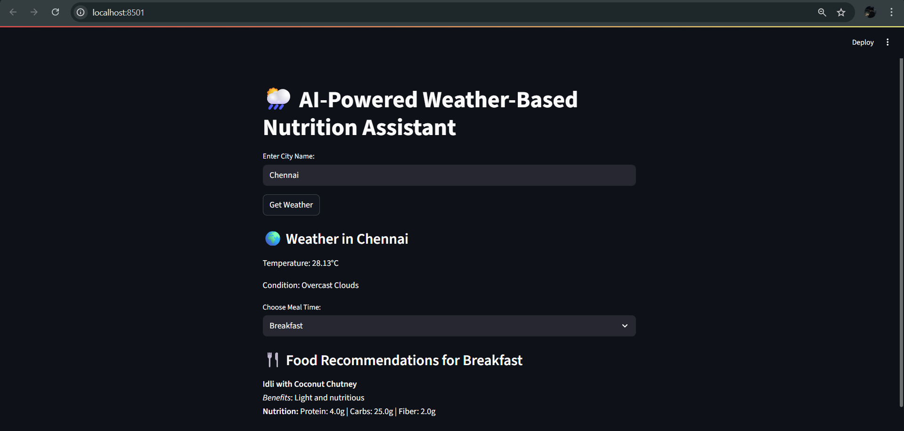

# 🌦️ AI-Powered Weather-Based Nutrition Assistant

This project is an AI-driven system that recommends suitable meals based on **current weather conditions** and **meal time**.  
It fetches live weather data using an API, processes it, and retrieves food recommendations from a MySQL database.  
The application is built using **Streamlit** for a clean and interactive UI.

---

## ✨ Features
- 🌍 Fetches live weather data for any city worldwide.  
- 🍽️ Provides food recommendations for **Breakfast, Lunch, and Dinner**.  
- 📊 Stores and retrieves food items from a MySQL database.  
- ⚡ User-friendly Streamlit interface.  
- 🛠️ Easy to set up and extend with more recipes.

---

## 🚀 Installation

1. Clone this repository:
   ```bash
   git clone https://github.com/yourusername/AI-Nutrition-Assistant.git
   cd AI-Nutrition-Assistant


## 🎮 Usage

Enter a city name in the input box.
View real-time weather conditions.
Select a meal time (Breakfast, Lunch, Dinner).
Get food recommendations based on weather and nutrition.


## 📷 Screenshot
<h2 align="center">Application Screenshot</h2> <p align="center">  </p>

---

## 🔗 Live Demo
👉 Click here to try the app

---

## 👨‍💻 Author
Kesavaraja M


